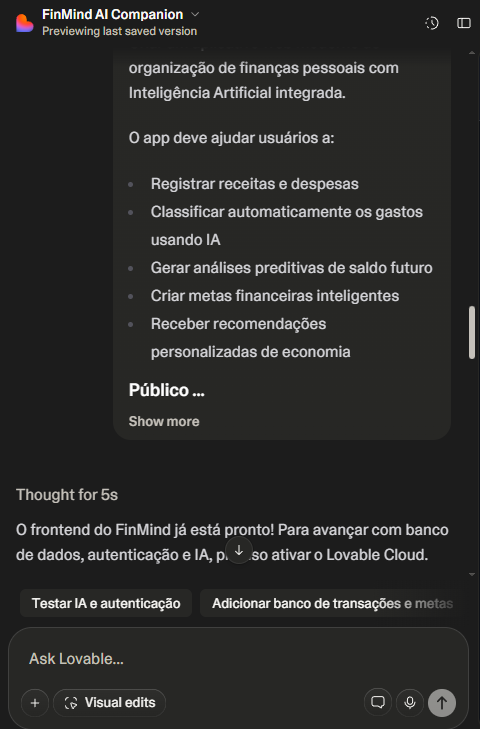
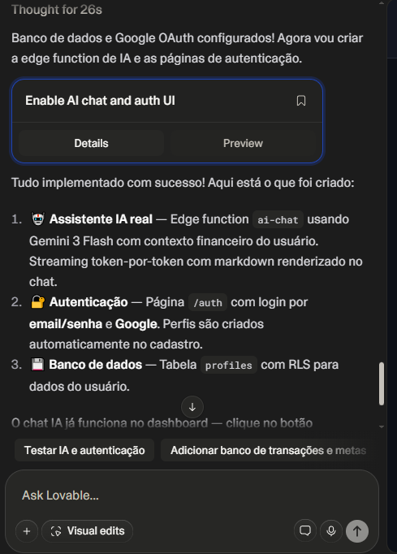
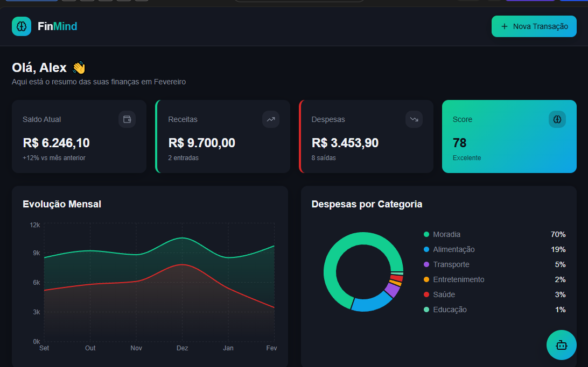

# 💸 FinMind AI

### Personal Finance with Artificial Intelligence


> Um aplicativo moderno de finanças pessoais com Inteligência Artificial para análise, previsão e tomada de decisões financeiras.

---

## 📌 Visão Geral

O **FinMind AI** é uma aplicação web desenvolvida para ajudar usuários a:

- Organizar suas finanças
- Entender seus padrões de consumo
- Tomar decisões financeiras mais inteligentes

Tudo isso com o suporte de **Inteligência Artificial integrada**.

---

## 🚀 Funcionalidades

### 📊 Dashboard Inteligente

- Saldo atual
- Gráficos de despesas por categoria
- Evolução financeira mensal
- Indicador de risco financeiro

### 💰 Gestão de Transações

- Registro de receitas e despesas
- Classificação automática via IA
- Sugestão inteligente de categorias

### 🤖 Assistente Financeiro IA

- Chat inteligente integrado
- Recomendações personalizadas
- Análise de comportamento financeiro
- Alertas de risco de déficit

### 🎯 Metas Financeiras

- Criação de metas
- Acompanhamento de progresso
- Sugestões automáticas de ajuste

### 📈 Previsão Financeira

- Simulação de saldo futuro
- Projeções baseadas no histórico do usuário

---

## 🧠 Inteligência Artificial

A IA é utilizada para:

- Classificar transações automaticamente
- Detectar padrões de consumo
- Gerar recomendações financeiras
- Prever cenários futuros

---

## 🖥️ Tecnologias Utilizadas

### Frontend

- Next.js
- React
- TailwindCSS

### Backend

- Node.js
- API REST

### Banco de Dados

- PostgreSQL

### Inteligência Artificial

- OpenAI API

---

## 📷 Demonstração

### 🔹 IA e Backend



### 🔹 Autenticação



### 🔹 Dashboard



---

## 📄 PRD (Prompt utilizado)

```text
PRD - FinMind AI

Visão Geral
Criar um aplicativo web moderno de organização de finanças pessoais com Inteligência Artificial integrada.

O app deve ajudar usuários a:

- Registrar receitas e despesas
- Classificar automaticamente os gastos usando IA
- Gerar análises preditivas de saldo futuro
- Criar metas financeiras inteligentes
- Receber recomendações personalizadas de economia

Público-Alvo
Jovens adultos e profissionais que desejam organizar melhor suas finanças e receber orientação automatizada baseada em IA.

Funcionalidades Principais

1. Dashboard Inteligente
- Exibir saldo atual
- Gráfico de despesas por categoria
- Gráfico de evolução mensal
- Indicador de risco financeiro

2. Registro de Transações
- Adicionar receita ou despesa
- Classificação automática por IA
- Sugestão de categoria baseada na descrição

3. Assistente Financeiro IA
- Chat financeiro integrado
- Sugestões de economia personalizadas
- Análise comportamental de gastos
- Alertas de possível déficit futuro

4. Sistema de Metas
- Criar metas financeiras
- Acompanhar progresso
- Sugestões de ajustes automáticos

5. Previsão Financeira
- Simulação de saldo futuro
- Projeção baseada em comportamento anterior

Requisitos Técnicos
- Frontend moderno (React ou Next.js)
- Backend Node.js
- Banco de dados PostgreSQL
- Integração com API de IA (OpenAI)
- UI minimalista e responsiva
- Tema escuro elegante

Diferenciais
- Sistema de score financeiro
- Alertas inteligentes
- Design estilo fintech
- Experiência fluida

Objetivo Final
Criar um MVP funcional com foco em experiência do usuário e inteligência preditiva.

## 🧪 Processo de Desenvolvimento

Este projeto foi desenvolvido utilizando:

- GitHub Copilot
- Lovable AI

Aplicando o conceito de Vibe Coding, guiando a IA com prompts estruturados para acelerar o desenvolvimento.
```

## 📚 Aprendizados

- Estruturação de PRD para IA
- Uso prático de Inteligência Artificial em produtos reais
- Integração frontend + backend + IA
- Importância de UX em produtos financeiros
- Como usar IA como ferramenta de produtividade

## 🎯 Próximos Passos

- Integração com Open Finance
- Notificações inteligentes
- Versão mobile (React Native)
- Modelos preditivos mais avançados

## 👨‍💻 Autor

Felipe Marcuci

- GitHub: https://github.com/FelipeRuizMarcuci
- LinkedIn: https://www.linkedin.com/in/felipe-ruiz-marcuci-8674a6265/

## ⭐ Diferencial

Este projeto demonstra:

- Aplicação real de IA
- Pensamento de produto
- Arquitetura moderna
- Organização profissional

## 🏁 Conclusão

O FinMind AI transforma dados financeiros em decisões inteligentes, unindo tecnologia e experiência do usuário.
